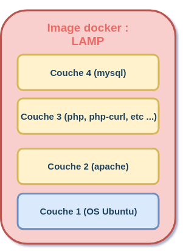

# Les images Docker 

Sur Docker, un **conteneur** est lancé en exécutant une **image**.

Une **image** est un **package** qui inclut tout ce qui est nécessaire à l'exécution d'une application, à savoir :

- Le code
- L'environnement d'exécution
- Les variables d'environnement
- Les bibliothèques
- Les fichiers de configuration

Une **image Docker** est créée à partir d'un fichier nommé `Dockerfile`. 

```Dockerfile
# Exemple d'un fichier Dockerfile

# Télécharger l'image Ubuntu
FROM ubuntu:latest
# Installer les packages MySQL
RUN apt-get update && apt-get install -y mysql-server mysql-client 
```

Une **image** est un modèle composé de plusieurs **couches**, ces **couches** contiennent l'application ainsi que les fichiers binaires et les bibliothèques requises. Lorsqu'une **image** est instanciée, elle l'est dans un **conteneur**, un **conteneur** est donc une instance d'une image qui peut être démarrée et arrêtée.

Pour mieux comprendre le système de couche, imaginons par exemple que nous souhaitons utiliser Docker pour déployer une application web dans un serveur LAMP (**L**inux **A**pache **M**ysql **P**hp).

Pour un tel environnement, nous aurons besoin de:

- Une couche **OS** pour exécuter Apache, MySQL et PHP.

- Une couche **Apache** pour démarrer le serveur web avec éventuellement la configuration associée (.htaccess, hôtes virtuels, etc...).

- Une couche **PHP** qui contiendra un interpréteur PHP ainsi que les modules nécessaires (pdo_mysql, php_curl etc...).

- Une couche **MySQL** qui contiendra notre système de gestion de bases de données relationnelles.

L'image Docker sera alors composée de quatre couches :

 

Il est important de bien différencier une `image Docker` d'un `conteneur Docker` car ce sont deux choses distinctes, Sur le chapitre précédent nous avions téléchargé et éxécuté l'image "hello-world", je vais m'appuyer au début sur cette image pour vous dévoiler quelques commandes de manipulation d'images Docker et par la suite nous téléchargerons d'autres images.

